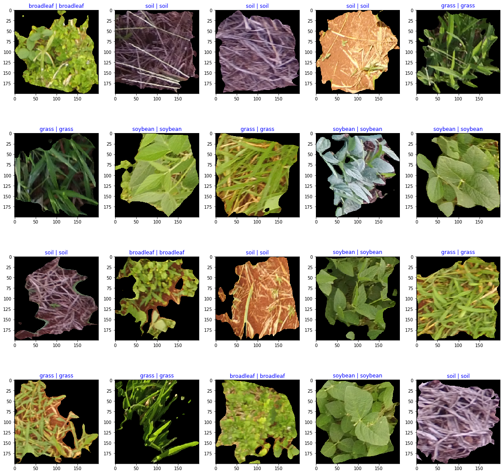

## ML Project  for Weed detectition

This project use [Kaggle dataset](https://www.kaggle.com/fpeccia/weed-detection-in-soybean-crops) to predict weed detection in soybean crops.

This project contains tree files, one with Keras, other with Neural Network from scratch, and other with pre-trained model(MobileNet) 

## Reference
- [Kaggle](https://www.kaggle.com/fpeccia/weed-detection-in-soybean-crops)
- [Keras](https://keras.io/)

Project for Siraj course to learn ML with python.